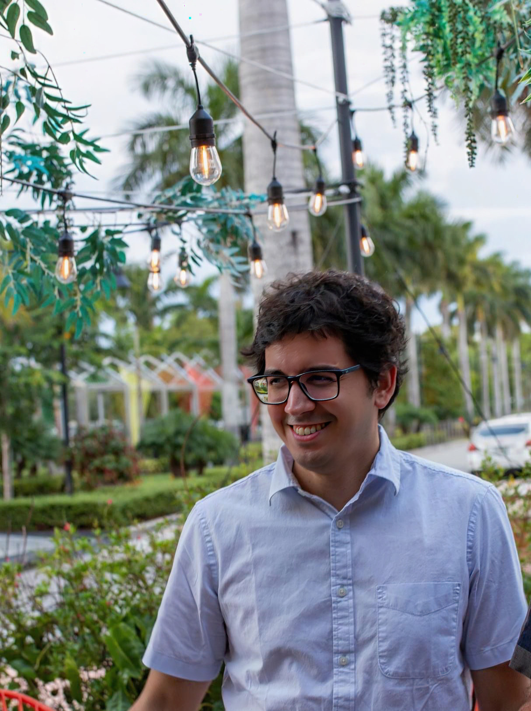

Hi, I’m Francisco Cardozo! I’m a researcher passionate about using data and technology to make a difference in prevention science. My work is all about developing and evaluating programs that prevent health challenges, and I’m especially excited about how AI can improve the way these interventions are implemented. I’m also a big believer in open-source software and love contributing tools and resources to make research more accessible and transparent. At the end of the day, my goal is to bring innovation into public health to create meaningful, lasting change.

-   [CV](https://github.com/focardozom/cv/blob/main/cv.pdf){target="_blank"} 
-   [Teaching](https://github.com/focardozom/Advanced-Research-Methods){target="_blank"} 
-   [Publications](https://orcid.org/0000-0002-1925-4954){target="_blank"} 
-   [GitHub](https://github.com/focardozom){target="_blank"} 

## Workshops

- [Workshops website](https://focardozom.github.io/workshops/){target="_blank"} 

## Web Projects

- [Business That Care Toolkit](https://test-toolkit.netlify.app/){target="_blank"} 
- [Thrustworthy](https://francisco-cardozo.shinyapps.io/thrusworthy/){target="_blank"} 

## R Packages

- [BreakNBuild](https://focardozom.github.io/BreakNBuild/){target="_blank"}: Designed to evaluate model performance with progressively sampled data.

- [DocumentData](https://github.com/focardozom/DocumentData){target="_blank"}: Designed to facilitate dataset documentation during package creation.

- [wandR](https://github.com/focardozom/wandR){target="_blank"}: Designed to transform R learning into an entertaining journey for all, by weaving the magic of the wizarding world into R programming.

- [ChessOlympiad](https://github.com/focardozom/ChessOlympiad22){target="_blank"}: This package contains three datasets to analyze the performance of 937 players from 188 countries during the Chess Olympiad in Chennai, India in 2022.

- [rUM](https://raymondbalise.github.io/rUM/){target="_blank"}: R Markdown and Quarto templates for academic papers and slide decks from the University of Miami.

- [DedooseR](https://abiraahmi.github.io/DedooseR/){target="_blank"}: Streamlines analysis of qualitative data exported from Dedoose, with support for thematic saturation, code frequencies, and network maps.

- [ghosted](https://abiraahmi.github.io/ghosted/){target="_blank"}: De-identify interview transcripts in VTT, DOCX, and TXT formats with support for batch processing.

## Communities

- [Software Carpentry](https://software-carpentry.org/){target="_blank"}
- [rOpenSci](https://ropensci.org/){target="_blank"}
- [Society for Prevention Research](https://www.preventionresearch.org/){target="_blank"}
- [International Network for Social Network Analysis](https://www.insna.org/){target="_blank"}

## Contact 

-  📧 foc9@miami.edu
- [Personal card](https://francisco-card.netlify.app)
